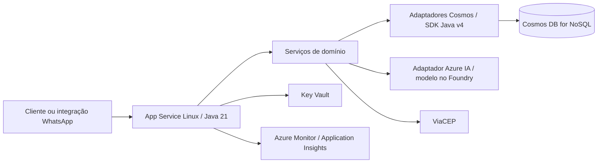

# Plano de migração para Azure Cosmos DB, Azure OpenAI e implantação no Azure

**Data:** 2026-09-05

**Estado:** implementação local em andamento; nenhum recurso Azure, migração real ou deploy executado

**Branch local:** `feat/azure-cosmos-db-migration`, criada a partir de `main` em `93bd40a`

**Decisão arquitetural:** [ADR-0001](adr/0001-azure-cosmos-db.md)

## 1. Objetivo e premissas

Migrar atendimentos, mensagens e catálogo de JPA/PostgreSQL para Azure Cosmos DB for NoSQL, substituir o Gemini por Azure OpenAI no Microsoft Foundry e publicar o backend Java no Azure App Service. Preservar regras de atendimento, encaminhamento humano, consulta de CEP e contexto de conversa.

O serviço confirmado para o adaptador é Azure OpenAI no Microsoft Foundry, pela Chat Completions API v1 e Structured Outputs. O nome do deployment é configuração obrigatória e o código não fixa um modelo. A autenticação alvo no App Service é identidade gerenciada; chave de API permanece disponível como opção explícita. A integração completa com um provedor WhatsApp não faz parte deste plano: o webhook atual aceita o DTO da própria aplicação.

Antes de provisionar, registrar:

| Informação pendente | Hipótese para planejar | Consequência da confirmação |
|---|---|---|
| Existem dados PostgreSQL a preservar? | Tratar migração como necessária até verificar | Sem dados, dispensar ETL; com dados, ensaiar carga e reconciliação |
| Volume e pico de uso | Pequeno porte, um estabelecimento | Medir RUs por interação e tamanho do histórico antes de definir capacidade |
| Assinatura, região e orçamento mensal | API e banco na mesma região; localização da IA a validar | Confirmar disponibilidade dos serviços e estimar App Service, Cosmos, Azure IA, logs, Key Vault e rede |
| Deployment Azure OpenAI | Serviço e API confirmados; modelo/deployment ainda sem valor definido | Confirmar modelo disponível, nome do deployment, região, quotas de tokens/requisições, filtros, qualidade e localização do processamento |
| Disponibilidade e janela de parada | Corte com janela de manutenção | Se interrupção não for aceitável, redesenhar a captura de alterações antes da implementação |
| Contrato dos consumidores | É possível coordenar a atualização | IDs string e paginação exigem mudança do consumidor; se não for possível, criar v2 |
| Retenção e recuperação | Sem TTL automático no início | Definir retenção, acesso, backup, RPO e RTO antes de produção |
| Frontend a publicar | Backend é o escopo principal | Se usar `renovo-fe`, alinhar integração e hospedagem separadamente |

## 2. Diagnóstico do código

| Área | Evidência no repositório | Impacto |
|---|---|---|
| Dependências | `pom.xml`: Java 21, Boot 3.4.5, JPA, PostgreSQL, H2 | Acrescentar SDK Cosmos e identidade; separar dependências SQL durante transição |
| Atendimento | `entity/AtendimentoEntity.java`: `Long`, campos de estado, `OneToMany` com cascade e orphan removal | Transformar em resumo de atendimento sem histórico embutido |
| Mensagens | `entity/MensagemAtendimentoEntity.java`: FK para atendimento, data e direção | Documentos independentes com referência explícita ao atendimento |
| Sessão | `AtendimentoService.buscarConversaAtiva`: telefone + `RECEBIDO`/`PROCESSADO` + data | Preservar regra de elegibilidade e janela de 30 minutos configurável |
| Gravação | `AtendimentoService`: métodos `@Transactional` atualizam estado e acrescentam mensagens | Usar batch explícito e controle de concorrência |
| Orquestração | `ChatbotService` chama persistência, Gemini/CEP e marca erro | Definir idempotência e recuperação de falha após chamadas externas |
| Provedor de IA | `GeminiClient`, `GeminiService`, `GeminiProperties` e `GeminiStructuredResponseDTO` | Extrair contrato independente do provedor, implementar adaptador Azure IA e substituir configurações `GEMINI_*` no ambiente alvo |
| Catálogo | `CatalogoRenovoRepository`, `CatalogoRenovoService`, `CatalogoRenovoDataLoader` | Traduzir filtros/ordenações; retirar carga automática indiscriminada na inicialização |
| Prompt | `PromptBuilderService` lê o catálogo completo e depende de entidades JPA de mensagem/produto | Usar objetos de domínio e cache por versão do catálogo |
| Contrato | `ChatbotResponseDTO`, `AtendimentoController`, `AtendimentoNotFoundException` usam `Long` | IDs string e atualização dos testes/consumidores |
| Listagens | `listarTodos`/`listarPorStatus` retornam listas completas | Adotar paginação por token de continuação |
| Configuração | `application.yml` contém datasource/JPA; `prod` exige credenciais SQL | Isolar perfis para que Cosmos não inicialize datasource/Hibernate |
| Testes | Testes Spring usam perfil `test` e H2; há limpeza por `deleteAll()` do repositório | Separar testes de domínio e integração por adaptador; não depender de cascade no Cosmos |
| Exposição | Controllers consultados não têm autenticação; `pom.xml` não inclui Spring Security | Proteger consultas administrativas antes da exposição pública |
| Frontend vizinho | `../renovo-fe/js/script.js` usa `POST /api/portal/chat` | Integracao concluida com contrato `sessionId/message`, resposta `respostaGerada` e CORS configuravel |

Os caminhos Java da tabela partem de `src/main/java/br/edu/usc/campusiachatbot/`; configurações partem de `src/main/resources/`. O diagnóstico foi feito por leitura do código, sem acessar banco ou executar a aplicação.

## 3. Arquitetura alvo

O runtime autentica no Cosmos com identidade gerenciada. A infraestrutura cria conta, database, containers e índices; a aplicação recebe permissão de dados e não cria recursos em cada inicialização. Manter um `CosmosClient` singleton por processo e encerrar no shutdown. [Boas práticas Java](https://learn.microsoft.com/en-us/azure/cosmos-db/best-practice-java).

## 4. Documentos, partições e consultas

Database proposto: `campus-ia-chatbot`. Os nomes são configuráveis por ambiente.

| Container | Chave de partição | Tipos de documento e IDs propostos |
|---|---|---|
| `conversas` | `/clienteChave` | Resumo: `atendimento:<uuid>`; mensagem: `mensagem:<uuid>`; controle: `sessao:ativa`; deduplicação: `evento:<origem>:<idExterno>` |
| `catalogo` | `/catalogoId` | Produto: `produto:<codigoCatalogo>`; valor inicial de partição `renovo` |

`clienteChave` será o telefone normalizado por uma função única usada no request e no ETL. Definir país/DDD e rejeitar ambiguidades; não acrescentar prefixos sem informação. Preservar telefone original para auditoria de transformação. A chave é dado pessoal e deve ser omitida de logs, URLs e telemetria. A aplicação atual não separa estabelecimentos; uma expansão futura exige incluir esse escopo na identidade e nas consultas.

Todos os documentos terão `id` string, discriminador `tipo` e `schemaVersion`. Atendimento mantém campos de negócio atuais, `atendimentoId` público, `legacyId` opcional e controle de versão. Mensagem mantém `atendimentoId`, direção, conteúdo, instante UTC e uma sequência ordenável. Controle de sessão mantém atendimento ativo, última atividade e estado de processamento. Deduplicação mantém chave externa, estado da operação e referência ao resultado.

Definir `atendimentoId` como UUID para novos registros e `legacy-<idSQL>` para importados. O ID físico do resumo será `atendimento:<atendimentoId>`. Para catálogo, `codigoCatalogo` é a identidade natural; guardar o ID SQL apenas como `legacyId` se houver referências a preservar.

Preços serão armazenados como inteiros em centavos (`precoAtualCentavos`, `precoOriginalCentavos`) e convertidos para `BigDecimal` no domínio. Preservar nulos, enums e escala de duas casas. Datas novas serão `Instant`/UTC; para `LocalDateTime` legado, identificar o fuso original antes da conversão, sem presumir que os valores já sejam UTC.

| Operação atual | Acesso proposto | Índices/limites a validar |
|---|---|---|
| Buscar conversa ativa | Point read de `sessao:ativa` com `clienteChave`, seguido do resumo | Validar status elegível e horário de atividade em cada uso |
| Criar/continuar atendimento | Batch no container `conversas` e na partição do cliente | Sessão + resumo + mensagem + deduplicação quando aplicável |
| Últimas N mensagens | Filtro por `tipo=mensagem` e `atendimentoId`, dentro da partição; `ORDER BY sequencia DESC` | Índice composto proposto: `tipo ASC`, `atendimentoId ASC`, `sequencia DESC`; inverter no serviço para contexto cronológico |
| Consulta por ID público | Consulta parametrizada por `tipo=atendimento` e `atendimentoId`, inicialmente entre partições | Medir RUs; não apresentar como point read sem conhecer a chave. Índice auxiliar de localização só se medição justificar |
| Listar atendimentos | Filtro `tipo=atendimento`, ordenação por `dataProcessamento DESC, atendimentoId DESC`, paginação | Índice composto correspondente; consulta entre partições |
| Listar por status | Filtros `tipo=atendimento` e `status`, mesma ordenação | Índice composto: `tipo ASC`, `status ASC`, `dataProcessamento DESC`, `atendimentoId DESC` |
| Catálogo por código | Point read por ID determinístico e `catalogoId` | Unicidade pelo par partição + ID, independente da categoria |
| Categoria/nome/preço | Consultas na partição `renovo`; campos normalizados e centavos | Índices para categoria+produto e intervalo de preço; medir busca por substring separadamente |
| Catálogo para prompt | Consulta paginada ordenada por código e cache em memória por versão | Invalidar por versão/intervalo definido; mesma versão visível em todas as instâncias |

Validar os índices com as consultas reais e diagnostics do SDK; não copiar sintaxe JPQL. Excluir conteúdo de mensagens, respostas e descrições dos índices quando não participarem de consultas. Nunca executar listagens de atendimentos sem o discriminador, pois o container mistura tipos.

Mensagens separadas evitam atingir o limite de 2 MB por item. Monitorar tamanho por cliente, pois a partição lógica comum tem limite de 20 GB. Um catálogo numa partição é uma concessão para o porte observado. [Limites do Cosmos](https://learn.microsoft.com/en-us/azure/cosmos-db/concepts-limits).

### Consistência, idempotência e falhas

1. Criar ou atualizar `sessao:ativa` por operação condicional. Duas criações simultâneas disputam o mesmo ID/partição; em conflito, reler e decidir. Não usar upsert cego para sobrescrever uma sessão concorrente.
2. Gravar resumo, mensagem do cliente e controle da interação em batch. Resposta do bot e novo estado formam outro batch, após concluir a chamada ao Azure IA. Cada batch deve ficar abaixo de 100 operações, 2 MB e 5 segundos. [Transactional batch](https://learn.microsoft.com/en-us/azure/cosmos-db/transactional-batch).
3. Usar `_etag`/If-Match para alterações concorrentes e um número de sequência atualizado no mesmo batch para desempatar mensagens. Em conflito, reler com tentativas limitadas.
4. Serializar o processamento por cliente com controle persistido e prazo de expiração do processamento em curso. Apenas `_etag` no momento de salvar não impede duas chamadas Azure IA com contextos diferentes. Ensaio deve cobrir duas instâncias e recuperação após queda.
5. Adicionar suporte a ID de evento do provedor ou `Idempotency-Key`, hoje ausentes no DTO. Repetição da mesma chave deve retornar resultado persistido sem nova mensagem/resposta; mesma chave com payload diferente deve ser rejeitada. Não deduplicar somente pelo texto da mensagem.
6. Em timeout de gravação, verificar o registro de operação antes de reenviar. Persistir e reaproveitar o resultado Azure IA quando já conhecido. Não prometer execução exatamente uma vez de uma chamada externa após queda do processo.
7. Preservar a exceção original se `marcarErro` também falhar; controlar mudanças de estado por versão e interação para que uma requisição antiga não marque como erro uma resposta mais recente. Respeitar `Retry-After` em 429, com limite total de espera.
8. Começar com consistência Session e verificar leitura após escrita entre instâncias. Propagar tokens de sessão quando necessário e validar leitura atual do controle compartilhado; se a estratégia não satisfizer a ordenação exigida, avaliar consistência mais forte antes de escalar. [Gerenciamento de consistência](https://learn.microsoft.com/en-us/azure/cosmos-db/how-to-manage-consistency).
9. A janela de inatividade segue a configuração atual; atendimento em análise humana não volta a ser sessão ativa. TTL não será usado para encerrar conversa nem apagar histórico automaticamente.

## 5. Contrato HTTP e refatoração

- Trocar `Long` por `String` em DTOs, parâmetros de consulta, exceções e contratos internos. Exemplo: `"idAtendimento": 123` passa a `"idAtendimento": "legacy-123"`; novo atendimento recebe UUID.
- Paginar listagens com `pageSize` (proposta: padrão 50, máximo 100) e `continuationToken`; resposta proposta `{ "items": [], "continuationToken": null }`. Token é opaco, vinculado ao filtro e não deve aparecer em logs. O limite de itens não garante uma página cheia. [Paginação Cosmos](https://learn.microsoft.com/en-us/cosmos-db/query/pagination).
- Essas duas mudanças quebram o contrato atual. Publicar backend e consumidores em conjunto na janela de migração ou disponibilizar `/api/v2` e manter a versão anterior até encerrar a transição. Definir a alternativa na fase 0.
- Extrair objetos de domínio para atendimento, mensagem e produto; criar interfaces como `AtendimentoStore` e `CatalogoStore` com operações de negócio, incluindo gravações atômicas. Não expor entidades JPA ou detalhes do SDK ao `ChatbotService`/`PromptBuilderService`.
- Manter adaptador JPA apenas durante transição e comparação. O adaptador Cosmos deve implementar explicitamente cada operação; remover `@Transactional` de caminhos que deixarem de usar o gerenciador SQL.
- Usar importação com validação prévia e IDs determinísticos. Os runners de provisionamento e seed exigem flags explícitas, permanecem desabilitados em produção e são habilitados apenas para o emulador local. Registrar versão e resultado da importação; falha parcial pode ser retomada. Se for necessário publicar todo o catálogo de forma atômica, usar catálogo versionado e troca de versão ativa, não assumir atomicidade de `saveAll`.

### Integração Azure IA

- Criar uma interface como `InterpretacaoIaService` e um DTO de resposta independente de provedor. Adaptar `ChatbotService` para essa interface e mapear os campos atuais de `GeminiStructuredResponseDTO`, preservando classificação, resposta, confiança e encaminhamento humano.
- Implementar `AzureIaClient`/`AzureIaService` e propriedades próprias. Escolher API/SDK Java somente após confirmar o modelo e endpoint de inferência do deployment; o endpoint de projeto não deve ser confundido com o endpoint de inferência.
- Adaptar o formato multi-turn construído por `PromptBuilderService` ao provedor escolhido, incluindo instruções e histórico sem materializar o catálogo completo. A primeira inferência pode solicitar uma busca limitada por categoria, nome ou faixa de preço. O backend valida a consulta, aplica o limite no JPA/Cosmos e permite no máximo uma segunda inferência com os registros retornados. Pedidos genéricos recebem categorias limitadas para refinamento.
- Selecionar um modelo/API compatível com saída estruturada e validar o JSON recebido no backend. Tratar schema inválido, resposta truncada, recusa e bloqueio de conteúdo; preservar as regras locais de segurança e encaminhamento humano. Se a escolha for Azure OpenAI, conferir a compatibilidade específica de modelo/API com [structured outputs](https://learn.microsoft.com/en-us/azure/foundry/openai/how-to/structured-outputs).
- Preferir identidade gerenciada com Microsoft Entra ID e papel de inferência adequado ao recurso escolhido. Se a oferta exigir chave, armazená-la no Key Vault; não reutilizar a chave Gemini. [Autenticação no Foundry](https://learn.microsoft.com/en-us/azure/foundry/foundry-models/how-to/configure-entra-id).
- Configurar timeout, limite de tokens de saída e retentativas limitadas para 429/erros transitórios. Avaliar filtros de conteúdo, quotas e custo por interação. A indisponibilidade deve acionar resposta local/encaminhamento conforme regra definida; não retornar silenciosamente ao Gemini.
- Validar a troca de IA em homologação antes da virada do banco e registrar artefato, deployment, versão do modelo e versão do prompt. Tratar retorno de versão da IA separadamente do ETL reverso do banco.

## 6. Etapas de implementação e critérios de saída

Cada etapa depende da anterior, exceto a preparação descritiva de infraestrutura, que pode avançar após a prova do modelo. As caixas abaixo representam trabalho ainda não executado.

### Fase 0 — Preparar a linha de base

- [ ] Confirmar pendências da seção 1 e escolher contrato coordenado ou v2.
- [x] Escolher Azure OpenAI no Microsoft Foundry, Chat Completions API v1, Structured Outputs e identidade gerenciada como autenticação alvo.
- [ ] Escolher modelo/deployment e critérios de qualidade/custo; usar o comportamento Gemini atual como linha de base.
- [ ] Registrar contagens SQL, volume por cliente, tamanho máximo de conversa e consumidores dos IDs.
- [ ] Executar `mvn test` na base e guardar resultado; medir latência atual distinguindo banco, Gemini e CEP.
- [ ] Definir orçamento mensal e metas mensuráveis de latência, RPO/RTO e janela de manutenção.

**Saída:** inventário dos dados, contratos e critérios operacionais acordados.

### Fase 1 — Provar acesso e modelagem Cosmos

- [ ] Selecionar versões estáveis de `azure-cosmos`/`azure-identity` e resolver a árvore Maven com Java 21/Boot; verificar compatibilidade e suporte da versão Boot antes da implantação.
- [ ] Criar configuração `CosmosConfig` e propriedades; prototipar documentos, índices, autenticação e client singleton.
- [ ] Em ambiente isolado, demonstrar batch, conflito de sessão, histórico limitado e paginação por status.
- [ ] Medir RUs e latência com amostra representativa; validar JSON de preço, data, enum e nulo.
- [ ] Provar a integração Azure IA com histórico multi-turn, saída estruturada, autenticação e casos de encaminhamento humano em português.

**Saída:** prova executável sem dependência de JPA, dados corretos, inferência Azure IA validada e métricas para confirmar capacidade e modelo.

### Fase 2 — Implementar persistência e contratos

- [ ] Refatorar entidades/serviços para domínio e interfaces; implementar adaptadores Cosmos.
- [x] Implementar adaptador Azure OpenAI, DTO neutro e configuração; retirar a dependência de `GEMINI_*` da inicialização alvo e adaptar o prompt.
- [ ] Implementar IDs, normalização, índices, sequência de mensagens, sessão, deduplicação e tratamento de conflitos.
- [ ] Atualizar controllers, DTOs, exceções, documentação OpenAPI e consumidores conforme contrato escolhido.
- [ ] Substituir o loader de startup por importador explícito e implementar cache/versão do catálogo.
- [x] Tornar `application-cosmos.yml` independente do emulador e configurar o emulador somente com `local,cosmos`; as auto-configurações SQL permanecem excluídas no perfil Cosmos.

**Saída:** fluxos funcionais aprovados em Cosmos e Azure IA; inicialização `prod,cosmos` sem datasource/JPA nem variáveis `DB_*` ou `GEMINI_*`.

### Fase 3 — Validar comportamento e preparar Azure

- [ ] Manter testes unitários das regras com persistência simulada; adaptar os testes de controller ao contrato escolhido.
- [ ] Criar testes de integração Cosmos usando ambiente isolado: batch com falha, 409/412, duas mensagens simultâneas, retry/429, repetição de webhook, histórico ordenado, expiração de sessão, erro Azure IA e importação repetível.
- [x] Testar localmente o adaptador Azure com servidor HTTP simulado: requisição/schema, autenticação, schema inválido, timeout, 429, recusa/bloqueio e contexto multi-turn.
- [ ] Executar casos de qualidade, encaminhamento e falhas no deployment de homologação.
- [ ] Validar consultas e comportamento de consistência em uma conta Azure de homologação; H2 não substitui esses testes.
- [ ] Criar infraestrutura Bicep e pipeline de build/deploy com artefato versionado e autenticação OIDC.
- [ ] Proteger endpoints administrativos, configurar autenticação da integração pública, restringir Swagger/simulador conforme ambiente e permitir CORS apenas para origens necessárias.
- [ ] Mascarar o telefone atualmente registrado pelo `ChatbotService`; evitar corpos de conversa e segredos na telemetria.

**Saída:** `mvn verify` aprovado, implantação reproduzível em homologação e verificações de acesso/health/métricas concluídas.

### Fase 4 — Ensaiar e executar a migração

- [ ] Implementar ETL repetível com checkpoint e relatório de reconciliação; ensaiar em cópia dos dados.
- [ ] Ensaiar restauração e retorno ao PostgreSQL, incluindo registros criados após a virada.
- [ ] Executar corte da seção 8, validar smoke tests e observar métricas pelo período definido na fase 0.
- [ ] Após estabilização e fim da janela de retorno, remover dependências e perfis JPA/H2/PostgreSQL que não forem mais necessários e atualizar README/runbook.

**Saída:** dados reconciliados, clientes operando no Azure, recuperação ensaiada e documentação de operação atualizada.

## 7. Infraestrutura e configuração Azure

| Recurso | Configuração proposta |
|---|---|
| Resource Group | Separar ambientes e identificar custos com tags |
| App Service Plan + Web App | Linux/Java SE; validar Java 21 e SKU na região; executar JAR Spring Boot |
| Cosmos DB | API NoSQL; containers e políticas de índices versionados em Bicep; capacidade decidida por medição |
| Azure OpenAI / Microsoft Foundry | Recurso e deployment configurável; Chat Completions API v1 e Structured Outputs; validar modelo, região/tipo de deployment, quotas, filtros de conteúdo e custo por tokens |
| Identidade gerenciada | RBAC de dados Cosmos e `Cognitive Services OpenAI User` no recurso Azure OpenAI; identidade de deploy separada para provisionamento |
| Key Vault | Segredos das integrações que exigirem chave, com referências em App Settings; preferir autenticação sem chave para Azure IA |
| Monitoramento | Health Check, logs estruturados, Application Insights/Azure Monitor e alertas |
| Rede | HTTPS; acesso Cosmos restrito à aplicação. Validar VNet/private endpoint/DNS e custos conforme ambiente/SKU |
| Recuperação | Escolher modalidade de backup compatível com a conta e ensaiar restauração; documentar destino restaurado e troca de endpoint |

Identidade gerenciada não concede acesso a documentos automaticamente: atribuir o papel de dados apropriado, como `Cosmos DB Built-in Data Contributor`, no escopo necessário. Para Key Vault, conceder leitura dos segredos usados pela aplicação. [Acesso Cosmos](https://learn.microsoft.com/en-us/azure/cosmos-db/how-to-connect-role-based-access-control) e [Key Vault no App Service](https://learn.microsoft.com/en-us/azure/app-service/app-service-key-vault-references).

Variáveis reconhecidas pelo caminho Cosmos e Azure OpenAI:

| Variável | Uso |
|---|---|
| `SPRING_PROFILES_ACTIVE=prod,cosmos` | Seleciona o caminho sem DataSource/JPA; ainda requer validação no App Service |
| `AZURE_COSMOS_ENDPOINT` | Endpoint da conta |
| `AZURE_COSMOS_DATABASE=campus-ia-chatbot` | Database |
| `AZURE_COSMOS_CONVERSAS_CONTAINER=conversas` | Container de conversas |
| `AZURE_COSMOS_CATALOGO_CONTAINER=catalogo` | Container de catálogo |
| `AZURE_COSMOS_ESTABELECIMENTOS_CONTAINER=estabelecimentos` | Container de dados comerciais |
| `AZURE_COSMOS_PROVISIONING_ENABLED=false` | Exige opt-in para criar database e containers; local/emulador usa `true` |
| `AZURE_COSMOS_SEED_ENABLED=false` | Exige opt-in para carga dos arquivos versionados; local/emulador usa `true` |
| `AZURE_COSMOS_AUTENTICACAO=MANAGED_IDENTITY` | Usa identidade gerenciada no Cosmos |
| `AZURE_COSMOS_MANAGED_IDENTITY_CLIENT_ID` | Client ID opcional para identidade atribuída pelo usuário |
| `IA_PROVIDER=AZURE_OPENAI` | Seleciona explicitamente o adaptador Azure OpenAI |
| `AZURE_OPENAI_ENDPOINT` | Endpoint do recurso, como `https://<recurso>.openai.azure.com`; não aceita endpoint de projeto Foundry |
| `AZURE_OPENAI_DEPLOYMENT` | Nome do deployment enviado no campo `model` |
| `AZURE_OPENAI_AUTHENTICATION=MANAGED_IDENTITY` | Autenticação alvo; `API_KEY` é a alternativa explícita |
| `AZURE_OPENAI_MANAGED_IDENTITY_CLIENT_ID` | Client ID opcional para identidade atribuída pelo usuário |
| `AZURE_OPENAI_API_KEY` | Obrigatória somente quando `AZURE_OPENAI_AUTHENTICATION=API_KEY` |
| `AZURE_OPENAI_TIMEOUT=30s` | Timeout da autenticação e da chamada HTTP |
| `AZURE_OPENAI_MAX_OUTPUT_TOKENS=800` | Limite enviado como `max_completion_tokens` |
| `AZURE_OPENAI_MAX_RESPONSE_BYTES=65536` | Limite local do corpo da resposta |
| `CEP_LOOKUP_*`, `ESTABELECIMENTO_*`, `CHATBOT_*` | Preservar configurações atuais aplicáveis; `GEMINI_*` não são exigidas no caminho Azure OpenAI |
| `SERVER_PORT` | Alinhar com a configuração do runtime App Service escolhido e validar acesso ao JAR |

O perfil `local,cosmos` usa endpoint e chave do emulador no loopback e habilita provisionamento e seed. O perfil `prod,cosmos` usa `AZURE_COSMOS_ENDPOINT` e identidade gerenciada, mantendo ambos os runners desabilitados até opt-in explícito. A autenticação Azure OpenAI não usa cadeia de credenciais de desenvolvedor: `MANAGED_IDENTITY` usa somente a identidade do host Azure e `API_KEY` precisa ser selecionada explicitamente para execução local.

No pipeline: checkout → Java 21 → `mvn verify` → empacotamento → publicação do artefato → deploy em homologação → health e smoke tests → promoção. Criar health/readiness específicos para Cosmos; liveness não deve depender da disponibilidade do Azure IA. Validar inferência e permissões em smoke test separado, evitando gerar tokens a cada health check. O endpoint `/actuator/health` já existe, mas ainda não comprova acesso ao Cosmos.

Usar slot de staging quando o plano contratado permitir. Slots exigem Standard, Premium ou Isolated; em SKU sem slots, usar aplicação de homologação separada e deploy com manutenção. Manter configurações de ambiente e identidades corretas em cada destino. [Slots do App Service](https://learn.microsoft.com/en-us/azure/app-service/deploy-staging-slots).

Observar RUs por consulta/interação, 429, falhas 5xx, conflitos 409/412, latência p95 do banco, da IA e da API, tokens de entrada/saída, recusas/bloqueios, memória JVM, tamanho por partição e falhas externas. Orçamento deve somar hospedagem, banco, Azure IA, armazenamento/backup, logs e rede; este plano não fixa preço sem modelo, região e carga confirmados.

## 8. Migração de dados, corte e retorno

### Carga e ensaio

1. Se não houver dados persistidos, registrar essa conclusão e importar somente o catálogo validado. Caso contrário, identificar a fonte PostgreSQL e fazer backup restaurável antes da extração.
2. Exportar atendimentos, mensagens e catálogo de um snapshot consistente; armazenar exportações fora do Git, com acesso restrito. Conferir órfãos, códigos duplicados, telefones normalizados conflitantes e fuso das datas.
3. Gerar IDs determinísticos para importados (`legacy-<idSQL>` para o atendimento e `mensagem:legacy-<idSQL>` para mensagens), mantendo `legacyId`. Ordenar mensagens por data e ID SQL para criar sequência determinística.
4. Importar em lotes limitados, com checkpoint, limites de concorrência e tratamento de 429. Reexecutar a carga deve produzir os mesmos documentos, sem duplicação. Usar upsert de ETL somente no destino isolado ou com escritores suspensos, para não sobrescrever dados novos da aplicação.
5. Importar o catálogo existente se ele tiver alterações em relação ao CSV; não substituí-lo silenciosamente pela versão empacotada. Validar preço convertido para centavos, nulos e código natural.
6. Reconstruir `sessao:ativa` por cliente segundo a regra atual: atendimento mais recente em `RECEBIDO`/`PROCESSADO` dentro da janela de inatividade no momento do corte. Não reativar conversas expiradas durante a manutenção. Resolver ambiguidades antes de liberar escrita.
7. Conciliar contagens por entidade/status/cliente, relação mensagem-atendimento, totais monetários/valores do catálogo e hashes dos campos normalizados. Documentar diferenças justificadas por transformação. Dados de sessão e deduplicação não entram na contagem equivalente de linhas SQL.
8. Ensaiar carga completa e retorno, medir duração e reservar a janela de manutenção com base no resultado.

### Corte para produção

1. Registrar artefato SQL anterior, backup, configurações, mapeamento de IDs e responsável pela execução.
2. Colocar todas as entradas de escrita em manutenção, drenar requisições em voo e controlar entrega/retry do webhook. Se não existir fila durável, verificar o comportamento do provedor e comunicar indisponibilidade; não presumir retenção de mensagens.
3. Com escritores suspensos, executar snapshot/carga final e reconciliação. Para o porte inicial, preferir carga completa medida no ensaio; caso exceda a janela, implementar delta verificável antes da virada.
4. Publicar a aplicação Cosmos/Azure IA e consumidores compatíveis; executar smoke tests em contas de teste: inferência no deployment configurado, primeira mensagem, continuação, encaminhamento humano, catálogo, consulta por ID, filtro/paginação e falha controlada externa.
5. Liberar tráfego gradualmente; registrar o instante de virada e observar os limites definidos na fase 0. Manter o PostgreSQL preservado e sem receber novas escritas.

### Retorno sem perda silenciosa

- **Antes de liberar escritas no Cosmos:** voltar o artefato/configuração SQL e consumidores anteriores; verificar disponibilidade e reabrir tráfego.
- **Depois de liberar escritas no Cosmos:** suspender e drenar novamente as entradas; exportar e reconciliar alterações desde a virada antes de voltar. Apenas trocar o endpoint perde mensagens novas.
- Preparar o caminho inverso no ensaio: atualizar linhas pelo `legacyId`; para UUIDs novos, criar IDs SQL e manter mapa UUID → ID SQL, restaurando relações de mensagens, estado e datas. Restaurar também consumidores/contratos compatíveis e tratar eventuais IDs públicos já distribuídos.
- Definir gatilhos objetivos de retorno: divergência de dados não explicada, quebra de sessão/duplicação, falhas de acesso ou desempenho/custo fora dos limites acordados. Backup sozinho não substitui o ETL reverso dos dados posteriores ao corte.

## 9. Critérios finais de aceite

- [ ] API no Azure inicia sem PostgreSQL/H2 no perfil Cosmos e persiste após reinício.
- [ ] Inferência usa o deployment Azure IA configurado, sem exigir chave Gemini; histórico, schema, recusas, timeout e encaminhamento humano foram validados.
- [ ] Primeira mensagem e continuação mantêm atendimento, histórico e respostas corretos.
- [ ] Concorrência e repetição de evento não duplicam sessões, mensagens ou respostas persistidas.
- [ ] Preços, nulos, enums e horários migrados preservam o significado dos dados originais.
- [ ] IDs/paginação estão documentados e consumidores foram validados.
- [ ] Catálogo é atualizado de forma explícita e não regravado por cada reinício/escala.
- [ ] Consultas administrativas exigem autorização e telemetria não registra telefone/conversa/chaves.
- [ ] Migração reconciliada e procedimento de retorno ensaiado com dados posteriores à virada.
- [ ] Métricas de custo, latência e disponibilidade atendem aos limites definidos na fase 0.

## 10. Situação desta entrega

Implementados localmente: domínio e adaptadores Cosmos, batch/concorrência/idempotência/paginação, seed explícito, contrato neutro de IA, adaptador Azure OpenAI v1 com Structured Outputs e fallback seguro, autenticação por identidade gerenciada ou chave explícita, testes HTTP simulados e separação entre Cosmos cloud e emulador local. Permanecem pendentes modelo/deployment, infraestrutura, RBAC, testes em recursos Azure, ensaio de migração/retorno, proteção dos endpoints administrativos, telemetria e deploy. Nenhum recurso pago foi criado, nenhuma base real foi migrada e nenhuma chamada Azure OpenAI foi executada nesta entrega.
